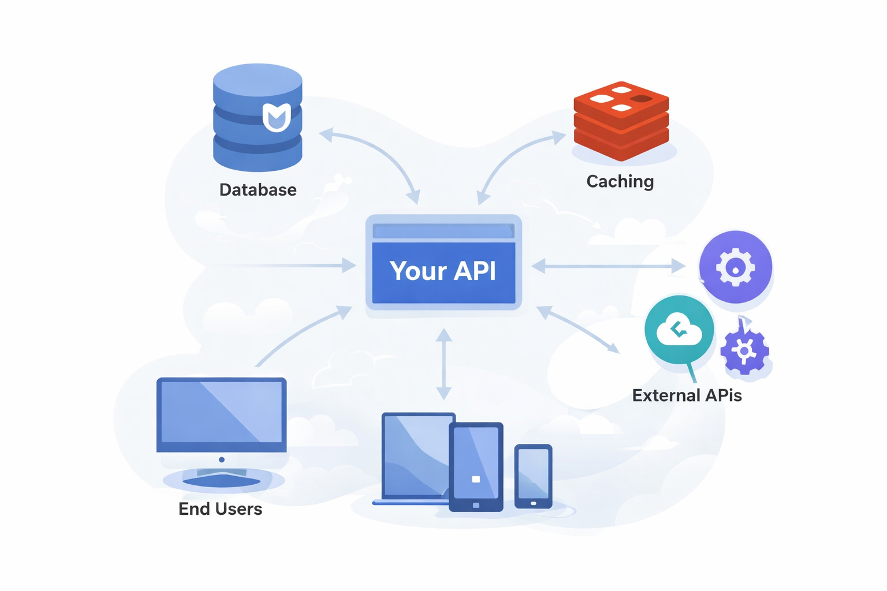

# File drive API

A Google Drive–like API (Node.js + TypeScript) with auth, files/folders, permissions, notifications, and Stripe billing.

> **Status:** Work in progress (WIP). This repository contains a backend API and related infrastructure for file/folder management, permissions, notifications (email + in-app), and subscriptions.

---

## Tech stack

- **Runtime:** Node.js
- **Language:** TypeScript
- **Web framework:** Express
- **Database:** MongoDB (Mongoose)
- **Cache / rate limiting:** Redis
- **Storage:** AWS S3 (recommended: presigned URLs)
- **Email:** AWS SES
- **Billing:** Stripe (Payment Intents + Webhooks)
- **Package manager:** pnpm

---

## Local development

### 1) Prerequisites

- Node.js (LTS recommended)
- pnpm
- MongoDB (local or container)
- Redis (local or container)

### 2) Configure environment

Create a local env file:

```bash
cp .env.example .env.local
```

Update values in `.env.local`.

### 3) Install dependencies

```bash
pnpm install
```

### 4) Run the API

```bash
pnpm dev
```

The server typically starts on `http://localhost:5000` (unless `PORT` is set).

---

## Stripe webhooks (important)

Stripe requires the **raw request body** to verify webhook signatures.

Your Express app should register the webhook endpoint with `express.raw()` **before** `express.json()` is applied globally.

Example (conceptual):

```ts
// Stripe webhook needs raw body on that route only
app.use("/api/payment/webhook", express.raw({ type: "application/json" }));

// Normal JSON parsing for everything else
app.use(express.json());
```

See: `docs/architecture.md` for the recommended request pipeline and the webhook note.

---

## Project structure (typical)

```txt
src/
  app.ts
  server.ts
  index.ts
  config/
  controllers/
  middleware/
  models/
  routes/
  services/
  utils/
docs/
  architecture.md
  SCHEMA.md
```

---

## Docs

- Architecture: `docs/ARCHITECTURE.md`
- Schemas: `docs/SCHEMA.md`

---

## License

MIT — see `LICENSE`.